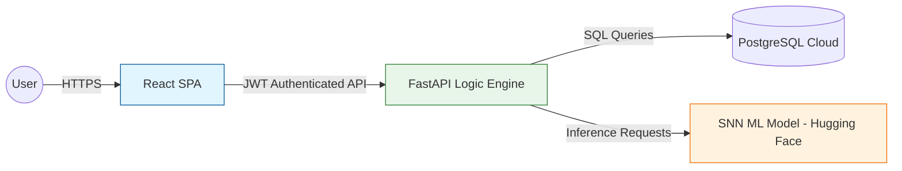

<div align="center">

# ✍️ LIPIKA: AI-Driven Academic Integrity Platform
### Advanced Handwriting Verification & Authentication Ecosystem

[](https://python.org)
[](https://fastapi.tiangolo.com)
[](https://reactjs.org)
[](https://neon.tech)
[](https://huggingface.co)

**LIPIKA** is an enterprise-grade educational solution engineered to safeguard academic integrity through **Deep Learning Handwriting Analysis**. By bridging the gap between traditional handwritten assessments and modern digital authentication, LIPIKA provides institutions with a robust, automated framework for verifying student authorship in real-time.

[**Explore Technical Deep-Dive**](./PROJECT_GUIDE.md) | [**View Implementation Report**](./PROJECT_REPORT.html)

</div>

---

## 📋 Executive Abstract

In the contemporary academic landscape, maintaining the authenticity of handwritten submissions is a critical challenge. **LIPIKA** (Sanskrit for "Writing" or "Script") addresses this by implementing a **Siamese Neural Network (SNN)** architecture that serves as a biometric signature for student handwriting. 

The system automates the verification process, allowing educators to focus on pedagogy while the AI engine handles the rigorous task of validating authorship against established baselines.

---

## 💎 Core Value Propositions

### 🛡️ Uncompromising Integrity
*   **Biometric Handwriting Analysis**: Utilizes unique stroke patterns, pressure points, and ligatures to create a distinctive digital footprint for every student.
*   **Anti-Forgery Layer**: Implements a proprietary **Power-of-10 Calibration Algorithm** to eliminate false positives and ensure high-precision matching.

### ⚡ Enterprise Architecture
*   **Decoupled Microservices**: High-performance React frontend communicating with a scalable FastAPI backend.
*   **Asynchronous Processing**: Non-blocking I/O operations ensure the system remains responsive even during intensive ML inference.
*   **Role-Based Access Control (RBAC)**: Fine-grained permission management for Administrators, Faculty, and Students.

### 🎨 Sophisticated User Experience
*   **Premium Design System**: A glassmorphic, responsive interface built for clarity and efficiency.
*   **Real-Time Analytics**: Dynamic data visualization for teachers to monitor class-wide integrity trends at a glance.

---

## 🏗️ Technical Ecosystem

### High-Level Architecture


### Stack Specifications
| Layer | Technology | Rationale |
| :--- | :--- | :--- |
| **Frontend** | React 18, Vite, Tailwind CSS | Modular component architecture with industry-leading build speeds. |
| **Backend** | FastAPI, Python 3.10+, SQLAlchemy | High-performance, type-safe API development with asynchronous support. |
| **Database** | PostgreSQL (Neon/Cloud) | Relational integrity with robust JSONB support for complex metadata. |
| **AI/ML** | Siamese Neural Networks, PyTorch | Specialized for similarity-based verification rather than simple classification. |
| **Security** | JWT, Bcrypt, UUID | Stateless authentication with enterprise-standard encryption. |

---

## 🚀 Deployment & Orchestration

### Prerequisites
*   **Runtime**: Node.js v18+, Python 3.10+
*   **Storage**: PostgreSQL instance (Local or Cloud)
*   **Environment**: Valid `.env` configuration in `/backend`

### Installation Sequence
1.  **Repository Initialization**
    ```bash
    git clone https://github.com/ak0425906-star/LIPIKA.git
    cd LIPIKA
    ```
2.  **Frontend Setup**
    ```bash
    npm install
    npm run dev
    ```
3.  **Backend Initialization**
    ```bash
    cd backend
    python -m venv venv
    source venv/bin/activate  # Or venv\Scripts\activate on Windows
    pip install -r requirements.txt
    uvicorn app.main:app --reload
    ```

---

## 🧪 Intelligence Matrix
The system categorizes authenticity based on calculated similarity thresholds, refined through our dynamic calibration engine:

| Confidence Level | Threshold | Actionable Status | Institutional Interpretation |
| :--- | :---: | :---: | :--- |
| 🟢 **Exemplary** | **≥ 85%** | **Authenticated** | High confidence match; matches student's baseline profile. |
| 🟡 **Marginal** | **60-84%** | **Review Flag** | Minor inconsistencies detected; requires manual faculty audit. |
| 🔴 **Critical** | **< 60%** | **Unverified** | Significant deviation; flagged as high-risk for academic dishonesty. |

---

## 👥 Strategic User Portals

### 🎓 Student Onboarding & Tracking
Secure portal for students to submit assignments and track their personal integrity metrics. Features seamless file uploads and real-time status updates.

### 🧑‍🏫 Faculty Review Command Center
A data-rich dashboard for teachers to manage submissions. Includes one-click verification, similarity heatmaps, and automated classification based on AI confidence.

### 🛡️ Institutional Administration
Global control over academic departments, subjects, and user enrollment. Provides the capability to manage the "Gold Standard" handwriting references used for verification.

---

## 📝 Governance & Attribution
**LIPIKA** is developed and maintained by **[ak0425906-star](https://github.com/ak0425906-star)**. 

Designed for scalability, security, and the future of academic excellence.

<div align="center">
<b>Verify. Authenticate. Trust.</b><br>
<i>LIPIKA — Empowering Educational Integrity through Innovation.</i>
</div>