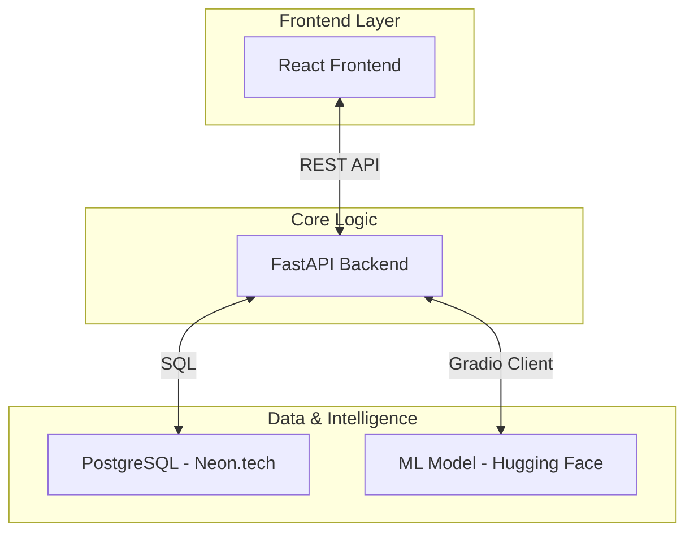

<div align="center">

# ✍️ LIPIKA
### Next-Gen AI Handwriting Verification & Academic Integrity Platform

> *The definitive bridge between traditional handwriting and digital authentication.*

[](https://python.org)
[](https://fastapi.tiangolo.com)
[](https://reactjs.org)
[](https://typescriptlang.org)
[](https://neon.tech)
[](https://tailwindcss.com)

</div>

---

## 🌟 Overview

**LIPIKA** is a sophisticated, full-stack educational ecosystem engineered to uphold academic integrity through **Deep Learning Handwriting Analysis**. By leveraging state-of-the-art computer vision models, LIPIKA validates the authenticity of student submissions in real-time, providing educators with a robust tool to verify that every assignment is truly the student's own work.

### 🎯 The Mission
In an era of increasing digital shortcuts, LIPIKA preserves the value of handwritten academic work by providing a secure, automated, and highly accurate verification layer.

---

## ✨ Premium Features

### 🎨 Modern UI/UX Experience
- **Glassmorphic Design**: A sleek, modern interface utilizing high-end aesthetics, smooth transitions, and a curated color palette.
- **Dynamic Dashboards**: Responsive, interactive portals for Students, Teachers, and Admins.
- **Micro-interactions**: Powered by Framer Motion for a premium, "app-like" feel.

### 🧠 Advanced AI Core
- **Siamese Neural Networks**: Utilizes advanced comparison logic to generate precise similarity scores.
- **Multi-Reference Baseline**: Collects multiple handwriting samples during onboarding for a more accurate "biometric" profile.
- **Real-time Processing**: Fast inference via dedicated Hugging Face ML endpoints.

### 🛡️ Enterprise-Grade Security
- **JWT Authentication**: Secure, stateless session management.
- **Bcrypt Hashing**: Industry-standard protection for user credentials.
- **Role-Based Access (RBAC)**: Strict permission boundaries between academic roles.

---

## 🆕 What's New (Latest Updates)

- **🚫 Zero-Demo Mode**: Completely removed all hardcoded demo data. The system now runs exclusively on real, user-created data.
- **🔄 Full API Synchronization**: Dashboards are now 100% reactive to backend database changes.
- **📊 Enhanced Analytics**: Teachers now get real-time stats on submission quality and match distributions.
- **📁 Smart Reference Management**: Admins can now manage, update, and audit student handwriting references individually.

---

## 🏗️ System Architecture



---

## 📂 Project Intelligence

```bash
LIPIKA/
├── src/                    # Frontend Architecture (React + TS)
│   ├── pages/              # Logic-heavy dashboard views
│   ├── lib/                # API client & core utilities
│   └── components/         # Premium UI component library
├── backend/                # Backend Architecture (FastAPI)
│   ├── app/                # Core API logic & models
│   │   ├── auth.py         # Security & JWT logic
│   │   ├── main.py         # Endpoint routing
│   │   └── models.py       # Database schema definitions
└── training_data/          # Local storage for ML reference samples
```

---

## 🚀 Deployment & Setup

### Requirements
- **Node.js** (v18+)
- **Python** (v3.9+)
- **PostgreSQL** (Managed or Local)

### Quick Start
1. **Clone & Install**:
   ```bash
   git clone https://github.com/ak0425906-star/LIPIKA.git
   npm install
   ```
2. **Backend Config**:
   Initialize a virtual environment in `/backend`, install `requirements.txt`, and configure your `.env` with `DATABASE_URL` and `JWT_SECRET_KEY`.
3. **Launch**:
   - Frontend: `npm run dev`
   - Backend: `uvicorn app.main:app --reload`

---

## 🧪 Verification Logic

| Threshold | Status | Interpretation |
|:---:|:---:|---|
| **≥ 85%** | 🟢 **Strong** | Authenticated. High confidence of match. |
| **60-84%** | 🟡 **Moderate** | Needs Review. Possible inconsistencies detected. |
| **< 60%** | 🔴 **Weak** | Flagged. Handwriting profile does not match. |

---

## 📝 License & Attribution

Built with passion for the academic community.  
**Developer**: [ak0425906-star](https://github.com/ak0425906-star)

---

<div align="center">
<b>LIPIKA — Verify. Authenticate. Trust.</b>
</div>
- View similarity scores and match history

### 🧑‍🏫 Teacher
- View all student submissions with similarity scores
- Accept or reject assignments based on match results
- Filter by Strong / Moderate / Weak matches

### 🛡️ Admin
- View all registered students
- Upload reference handwriting data for any student
- Full system management access

---

## 🌐 Deployment

| Component | Hosted On |
|-----------|-----------|
| Backend API | [Render](https://render.com) — `https://thxanozz.onrender.com` |
| Database | [Neon.tech](https://neon.tech) — PostgreSQL |
| ML Model | [Hugging Face](https://huggingface.co/spaces) — `thanoxz/ml-api` |

---

## 📝 License

This project is built for educational purposes.

---

<div align="center">

**Built with ❤️ by [ak0425906-star](https://github.com/ak0425906-star)**

</div>